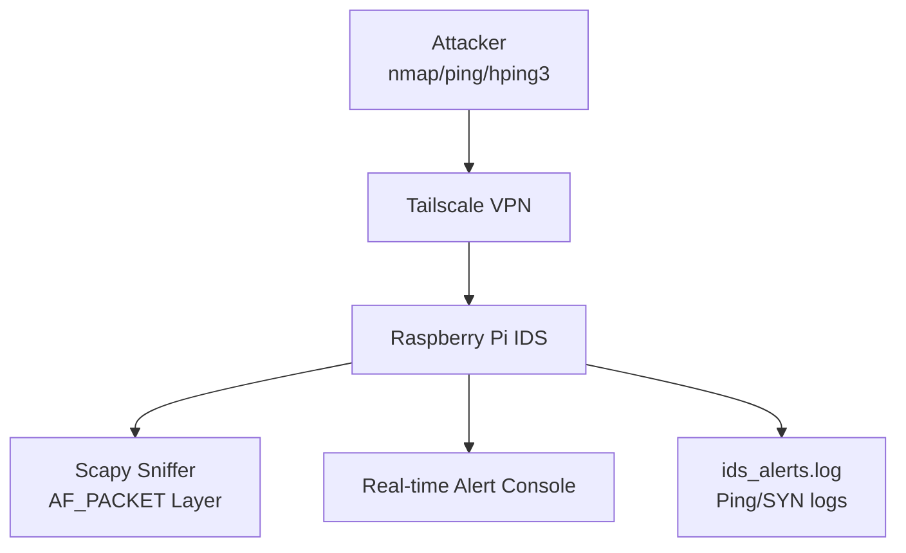

# 🍓 Raspberry Pi Intrusion Detection System (IDS)

As part of my work in CNIT 17600 (Information Technology Architectures), I developed a fully functional IDS on a Raspberry Pi to detect early-stage reconnaissance traffic—such as ICMP pings and TCP SYN scans—commonly used by attackers to map networks.

---

## 🔍 What It Does

| Feature                            | Description                                                                 |
|------------------------------------|-----------------------------------------------------------------------------|
| 📡 Packet Sniffing                | Uses Scapy to capture network packets in real time                         |
| 🛡️ Threat Detection               | Detects ICMP Echo Requests and TCP SYN packets (reconnaissance attempts)   |
| 📝 Logging                        | Alerts are written to both the terminal and a local log file               |
| ⚙️ Protocol Support              | Supports ICMP, TCP (SYN flags)                                             |
| 🧪 Validation                     | Tested using tshark, nmap, ping, and hping3                                |

---

## 📊 Architecture Diagram (Rendered with Mermaid)



---

## 🧪 Tech Stack

- **Language**: Python 3
- **Libraries**: `scapy`, `datetime`, `os`
- **Tools Used**: `tshark`, `nmap`, `ping`, `PowerShell`, `hping3`
- **Hardware**: Raspberry Pi 4
- **Interface**: `tailscale0` (VPN-based interface)

---

## 💡 Threat Intelligence Motivation

> 📈 Inspired by IBM’s X-Force Threat Intelligence Index (2022), which found that **40% of cyberattacks begin with reconnaissance**. This project focuses on **detecting before exploiting**.

---

## 🚀 Getting Started

### 🧰 Prerequisites

- Raspberry Pi with Python 3 installed
- Install `scapy`:
  ```bash
  pip install scapy
  ```
- Tailscale VPN (or another network interface)
- `tshark` (optional, for validation)

### 🔧 Run the IDS

```bash
sudo python3 pi_ids.py
```

You’ll start seeing real-time alerts like:

```
[2025-04-28 12:28:01] Ping detected from 100.114.6.22
[2025-04-28 12:28:06] SYN packet from 192.168.0.5:49672 to 192.168.0.1:22
```

Log file: `~/ids_alerts.log`

---

## 🧠 Key Concepts Learned

- Raw socket programming & AF_PACKET access via Scapy
- Packet structure analysis (ICMP, TCP)
- Filtering with Berkeley Packet Filter (BPF) syntax
- Real-time detection loop with flushable log writes
- Tshark capture validation and Nmap simulation testing

---

## 🧱 Use Cases

- 🧪 Student SOC Labs
- 🏠 Home Network Monitoring
- 📚 Classroom Demonstrations
- 🧱 Lightweight edge security deployments

---

## 🧬 Example Detection Snippet

```python
if pkt.haslayer(ICMP):
    if pkt[ICMP].type == 8:
        print(f"Ping detected from {pkt[IP].src}")

elif pkt.haslayer(TCP):
    if pkt[TCP].flags & 0x02:
        print(f"SYN packet from {pkt[IP].src} to {pkt[IP].dst}")
```

---

## 🚧 Future Work

- ✅ MVP complete
- ☁️ AWS CloudWatch log streaming (planned)
- 📬 Email/Slack integration for critical alerts
- 🧠 ML-based anomaly detection (long-term roadmap)

---

## 📁 File Structure

```text
├── pi_ids.py              # Core Python IDS script
├── ids_alerts.log         # Log of alerts generated by detection
├── README.md              # Project documentation
├── requirements.txt       # Python dependencies
└── .gitignore             # Ignore log files and Python cache
```

---

## 📜 License

MIT License
